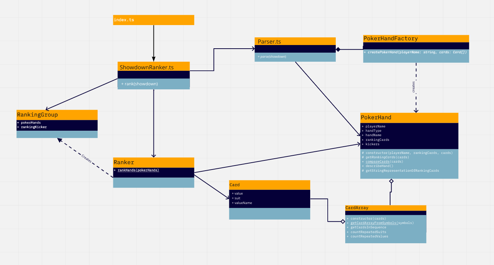

# Texas Hold'em Ranker

A project to rank hands in a Texas Hold'em showdown

## Quick Start
1. Clone this repo
2. Run `yarn install` from the command line in the project root directory
3. Run `yarn test` to watch the tests run and pass
4. Run `yarn start` to see the program start up and run

Enter several lines of input that look similar to the following:
```
KS AD 3H 7C TD
John 9H 7S
Sam AC KH
Becky JD QC
```

Press Enter twice to see the program run.

These lines represent the cards in a texas hold'em showdown. The first line represents
the 5 community or shared cards, while each subsequent line contains a player's name followed by their
hole cards. Cards are represented by symbols of two characters. The first character represents the card's
value, and the second represents it's suit.

The card's value will either be a number from 2-9, or one of:
 - T for 10
 - J for Jack
 - Q for Queen
 - K for King
 - or A for Ace

The card's suit should be one of 4 letters:
 - C for Clubs
 - D for Diamonds
 - S for Spades
 - H for Hearts

so "Simon 9D AS" means that Simon has two hole cards, the 9 of Diamonds, and the Ace of Spades.

## Program Structure

At the top-level, there are 3 main components in this code that are centrally coordinated by a showdown ranker:
1. a Parser, which parses the input strings into cards and poker hands,
2. a Ranker, which is responsible for Ranking poker hands relative to one another,
3. and a PokerHandFactory, which returns the highest possible ranking poker hand when given a set of cards.

Addtionally, there is an important helper class, CardArray, which is responsible for storing an array of Cards, 
and filtering or sorting those cards based on the card's suit or value.

A very rough class diagram is included below:


### Building the PokerHand
The parser reads user input and breaks it into PokerHands with the help of the PokerHandFactory. The PokerHandFactory
builds hands by taking in a set of 7 input cards (5 community cards + 2 hole cards) and attempting to build all hand types
from each. It then returns the highest value hand out of all possible hands. This makes the Ranker the sole source of truth
for the relative value of different hands.

Each PokerHand type inherits from a base PokerHand class. This takes advantage of polymorphism so that every class in the 
texasHoldem code doesn't need to know about every single type of PokerHand.

### Ranking card hands
Ranker.ts is responsible for ranking Poker Hands against one another. It starts by comparing the rank of each hand type 
based on their value in the HandType enum. If two hands are of an equivalently ranked type, the ranker then compares on 
card values, followed by the values of their ranking cards, and then by the kickers for each hand. For each equivalently
ranked set of cards, the Ranker creates a Ranking Group, which includes information on any shared kickers, if applicable.
The Ranker returns a list of RankingGroups for the ShowdownRanker, which then formats them for output to stdout. 

### Delegation over inheritance in Poker Hands
There is a lot of shared knowledge between each type of poker hand. The HighCard, Pair, Three of a Kind, Full House,
and Four of a Kind types are all essentially variants on the exact same logic used for any type of hand with a repeated
value. A Straight and a Flush can be combined to create a Straight Flush, and a Royal Flush is essentially a Straight 
Flush with all face cards. Instead of representing these relationships with inheritance I've delegated any shared bits of
functionality to either the CardArray, or to the PokerHand type they belong to.


